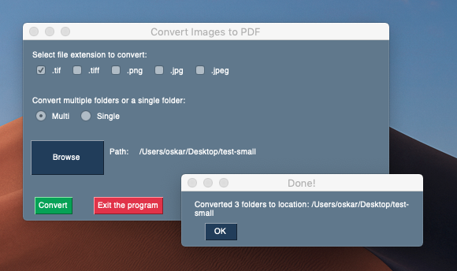

# Convert multiple images (.tif, .png, .jpg) to a single PDF file

## Easy to use

## Multi and Single mode
- Single mode converts a single directory of images to a single PDF
- Multi mode allows to convert multiple directories in a row. Just select a path where you have many folders containing image files

## Installation
### To run convert_to_pdf.py you'll need
- Python 3.7+

        pip install PySimpleGUI

        pip install Pillow

### To build a single .EXE file in Windows:
        pip install PyInstaller

        pyinstaller -wF convert_to_pdf.py